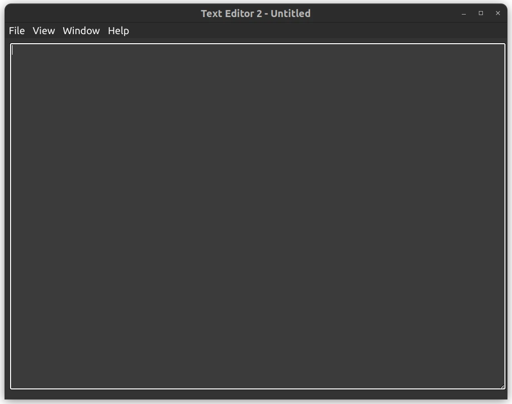

# TextEditor2

Cross platform text editor written in Electron.

## Dependencies
Install rpm to make a rpm package on Ubuntu or Debian
```
sudo apt install rpm
```

## Make a deb and rpm package for linux
```
npm run make -- --arch="x64" --platform="linux"
```



